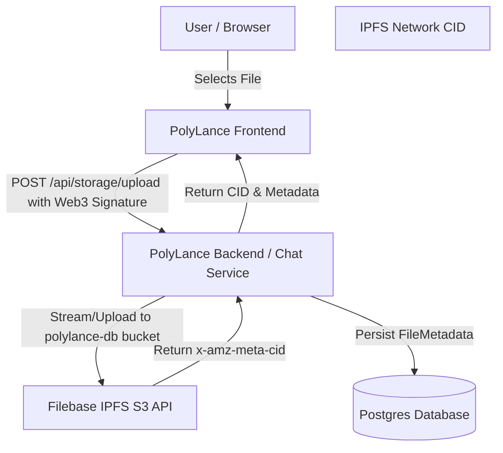

# PolyLance — Decentralized Filebase IPFS Storage Integration

This document outlines the architecture, API endpoints, database schema, and configuration for the decentralized file storage integration using Filebase IPFS buckets in PolyLance.

## Overview

PolyLance uses Filebase to provide a provider-agnostic, decentralized IPFS file storage architecture. Files uploaded by freelancers (such as proof-of-work deliverables, code zip archives, PDFs, or images) are pinned directly to the IPFS network and referenced by their canonical Content Identifier (CID).



## Backend API Endpoints

### 1. File Upload
*   **Endpoint:** `POST /api/storage/upload`
*   **Authentication:** Web3 Wallet Signature (Mandatory)
*   **Headers:**
    *   `x-address`: Wallet Address of the sender
    *   `x-signature`: Cryptographic signature proving ownership
    *   `x-message`: Plaintext message used to generate the signature
*   **Form Data:**
    *   `file`: The file binary (Max size: 50MB)
    *   `category`: Category prefix path (e.g. `proof-of-work`, `profiles`, `portfolio`)
    *   `entityId`: Optional entity reference ID (e.g., job Address or profile ID)
*   **Response (200 OK):**
    ```json
    {
      "success": true,
      "file": {
        "id": "uuid-string",
        "fileName": "sanitized_name.pdf",
        "mimeType": "application/pdf",
        "size": 102400,
        "cid": "bafybeig...",
        "storageProvider": "filebase-ipfs",
        "storageBucket": "polylance-db",
        "visibility": "public"
      }
    }
    ```

### 2. Retrieve Metadata
*   **Endpoint:** `GET /api/storage/metadata/:id`
*   **Response (200 OK):**
    ```json
    {
      "success": true,
      "file": {
        "id": "uuid-string",
        "fileName": "sanitized_name.pdf",
        "mimeType": "application/pdf",
        "size": 102400,
        "cid": "bafybeig...",
        "storageProvider": "filebase-ipfs",
        "storageBucket": "polylance-db",
        "visibility": "public",
        "createdAt": "2026-08-20T12:00:00Z"
      }
    }
    ```

### 3. Verify CID
*   **Endpoint:** `GET /api/storage/verify/:cid`
*   **Response (200 OK):**
    ```json
    {
      "success": true,
      "status": "Verified",
      "cid": "bafybeig...",
      "storageProvider": "filebase-ipfs",
      "gatewayUrl": "https://ipfs.filebase.io/ipfs/bafybeig..."
    }
    ```

### 4. Delete File
*   **Endpoint:** `POST /api/storage/delete/:id`
*   **Authentication:** Web3 Wallet Signature of the file owner
*   **Response (200 OK):**
    ```json
    {
      "success": true
    }
    ```

## Database Schema (Prisma)

```prisma
model FileMetadata {
  id              String   @id @default(uuid())
  ownerId         String?
  walletAddress   String
  fileName        String
  mimeType        String
  size            Int
  cid             String
  storageProvider String
  storageBucket   String
  storageKey      String
  visibility      String   @default("public")
  entityType      String?
  entityId        String?
  createdAt       DateTime @default(now())
  updatedAt       DateTime @updatedAt
}
```

## IPFS RPC API Integration

For programmatic interactions with the Filebase IPFS network, PolyLance supports the Kubo-compatible IPFS RPC API.

- **Endpoint:** `https://rpc.filebase.io`
- **Authentication:** Scoped bearer tokens. The token is generated by combining the access key, secret key, and target bucket, joined by colons, and encoding the result in Base64:
  `base64(accessKey:secretKey:bucketName)`
- **Header:** `Authorization: Bearer <token>`

Example Base64 credentials for `polylance-db`:
`OThEMTI5MzgwRDY3OTU0QjRDRDY6aXp2WXl3UlNyOVpDZUd3b3Q5aG5tcUFEcG91Q0I0QWNzWWVSa0VDSTpwb2x5bGFuY2UtZGI=`

## Security Controls
- **Filename Sanitization:** Filenames are stripped of path traversal sequences (e.g. `../`) and sanitized to permit only alphanumeric characters, dots, dashes, and underscores.
- **MIME & Size Boundaries:** Upload limits are strictly enforced both in the frontend and backend (50MB size limit, restricted to images, PDFs, archives, and JSON configurations).
- **Web3 Authentication:** Message signature checks ensure no malicious user can upload files or delete metadata under another wallet address.
